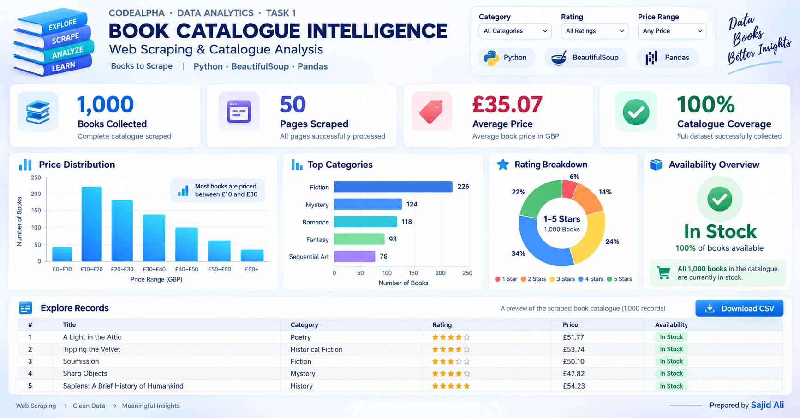

# Book Catalogue Intelligence — CodeAlpha Task 1

An end-to-end **web scraping and custom dataset project** created for the CodeAlpha Data Analytics Internship. The Python pipeline navigates the public [Books to Scrape](https://books.toscrape.com/) training catalogue, parses listing and product-detail HTML, creates a structured CSV dataset, generates summary reports, and refreshes a responsive interactive dashboard.

## 📊 Interactive Dashboard Preview

<p align="center">
  <a href="https://sajidexpertise.github.io/CodeAlpha-Web-Scraping-and-Book-Catalogue-Analysis-Task-1/">
    
  </a>
</p>

<p align="center">
  <strong>
    <a href="https://sajidexpertise.github.io/CodeAlpha-Web-Scraping-and-Book-Catalogue-Analysis-Task-1/">
      🚀 Open the Live Interactive Dashboard
    </a>
  </strong>
</p>

## Task alignment

| CodeAlpha requirement | Project implementation |
|---|---|
| Use BeautifulSoup or Scrapy | `scrape.py` uses Requests and BeautifulSoup |
| Extract public web data | Collects the Books to Scrape training catalogue |
| Handle HTML and navigation | Supports pagination and follows product-detail links |
| Create a custom dataset | Writes structured records to `data/books.csv` |
| Make information useful | Adds filters, charts, record exploration and CSV export |

## Collected fields

Title, displayed price (GBP), rating, availability, listing page, source URL, UPC, category, price excluding tax, price including tax, tax, available units, and review count.

> **Data note:** Books to Scrape is a demonstration website. Prices and ratings are training data, not real customer transactions, demand, revenue or profit.

## Quick start

### Open the dashboard immediately

Double-click `index.html` or `OPEN_DASHBOARD.bat`. The dashboard works directly from disk and includes a complete demonstration catalogue so every filter, chart, table, pagination control and CSV download can be tested without installing Python.

### Run a quick live scrape

Double-click `RUN_QUICK_DEMO.bat`. It collects five catalogue pages, refreshes the reports and opens the dashboard.

### Collect the complete catalogue

Double-click `RUN_SCRAPER.bat`. It processes up to 50 listing pages and then checks product pages concurrently for category, UPC and stock information. Runtime depends on the website and internet connection.

Manual commands:

```bash
python -m pip install -r requirements.txt
python scrape.py --max-pages 50 --workers 12
python analyze.py
python build_dashboard.py
```

For a smaller run:

```bash
python scrape.py --max-pages 5 --workers 12
```

## Dashboard functionality

- Category, rating and price-range filters
- Live KPI recalculation
- Price-distribution visualization
- Top-category comparison
- Rating breakdown
- Availability summary
- Title/category search
- Paginated records table
- Source link for every record
- Download the current filtered data as CSV
- Responsive desktop, tablet and mobile layouts

## Project structure

```text
Task_1_Web_Scraping/
├── index.html                 # GitHub Pages entry point
├── OPEN_DASHBOARD.html        # Compatibility redirect
├── OPEN_DASHBOARD.bat         # Local dashboard launcher
├── RUN_QUICK_DEMO.bat         # Five-page demonstration
├── RUN_SCRAPER.bat            # Complete scraper pipeline
├── scrape.py                  # Requests + BeautifulSoup scraper
├── analyze.py                 # Catalogue and quality summaries
├── build_dashboard.py         # Embeds CSV data for offline use
├── requirements.txt
├── data/
│   └── books.csv
├── dashboard/
│   ├── app.js
│   ├── data.js
│   ├── styles.css
│   └── dashboard.png
└── reports/
```

## GitHub Pages

Because `index.html` is included at the project root, GitHub Pages opens the dashboard directly when this project is used as a standalone repository.

If it is uploaded as `Task_1_Web_Scraping` inside the required `codealpha_tasks` repository, the project URL will be:

```text
https://sajidexpertise.github.io/codealpha_tasks/Task_1_Web_Scraping/
```

Enable Pages from **Settings → Pages → Deploy from a branch → main → /(root)**.

## Author

**Sajid Ali**  
Data Analytics Intern — CodeAlpha  
[GitHub](https://github.com/sajidexpertise) · [LinkedIn](https://www.linkedin.com/in/sajidexpertise/) · [Portfolio](https://sajidexpertise.vercel.app/)
